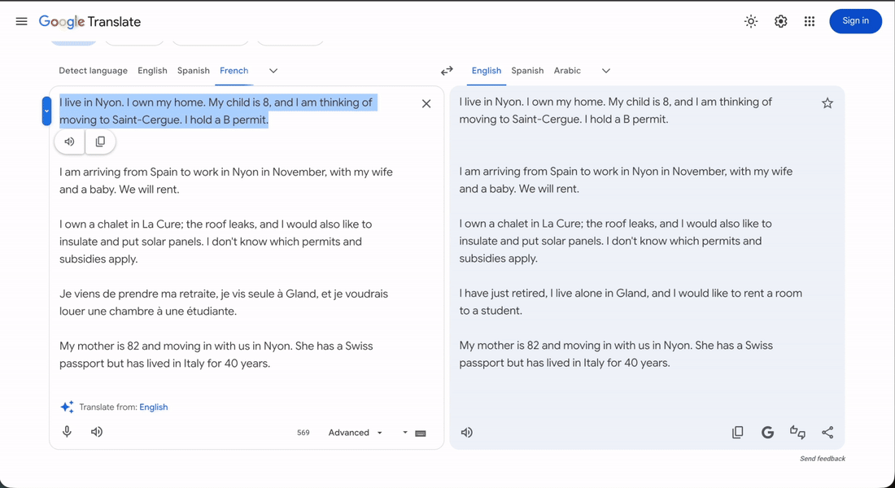

# Public AI for every commune

Swiss {ai} Weeks, Zurich · "Build a public AI service" challenge



## See the complete Demo
[](https://www.youtube.com/watch?v=FTBebfGJwR4)

Three-minute silent demo: six situations typed in, the maps Apertus draws, a source followed to vd.ch, French and English.

Live page: https://artfisica.github.io/zh-ai-weeks-build-a-public-ai-service-proposal/

## The idea

Public services are organised by department. People's lives are not. Someone who moves, retires, renovates a roof or arrives from abroad does not have a department; they have a situation, and the situation touches the commune, the canton and the Confederation at once.

This prototype starts from the situation. A person writes it in their own words, one or two sentences. Apertus, the Swiss open model, reads it and draws a map: parallel paths (registration, housing, money, school, work, transport…), each made of concrete steps with the office that handles them. The facts in the sentence that would change the map become underlined words; touching one proposes another value and shows, before anything is applied, which steps would change, appear or disappear. The facts the sentence does not give become questions under the map, asked only because their answer would grow a branch.

Every step rests on an official page, or says plainly that none is linked yet and who to ask. Apertus writes the steps and explanations and is named as their author on every one. It cannot invent a link: it can only choose from a catalogue of official pages kept in the code.

## What a visitor can do

- Write a situation and draw the map. Two examples are offered on the empty page.
- Open a point: the step, what its official page establishes (with a badge for commune, canton or Confederation), whether a commune has reviewed it, what Apertus explains, and who to confirm with. Mark it "I have done this"; the mark is kept in the browser.
- Touch an underlined word: Apertus's alternatives or a free value; the branches that would change grow dashed; a dashed point shows both versions side by side; then keep or adopt everywhere.
- Answer a "?" under the map: the new branch appears, marked added or modified.
- Explore: change words freely without touching the saved map, then come back to it.
- Correct or complete the sentence at any time; the map is redrawn.
- FR / EN in the header; the map is redrawn in the chosen language.

Everything a visitor draws stays in their own browser. The sentence they write is sent to the proxy and on to the model provider; nothing is stored server-side beyond a request counter.

## What it is, and what it is not

It is a working service: any situation, a map in 10 to 30 seconds, sources from a controlled catalogue, provenance on every text. It is bilingual and needs no login.

It is not reviewed content. No commune has read any step; every card says so. The catalogue currently holds thirteen pages, mostly Vaud, Nyon, Saint-Cergue and federal (ch.ch, SEM); a situation in another canton gets generic official entry points until its pages are added. Steps are written by a language model and must be verified on the linked page before acting; the interface says this on every screen.

## How the honesty rules are enforced

- Links come only from `CATALOG` in `index.html`: id, level (confederation, canton, commune), URL, and a description of what the page covers. The model is given the ids and descriptions and must choose or return `null`. Any other value is discarded before rendering.
- A step without a catalogue page is shown as "No official page linked for this step. Check with: [office]", never with a guessed link.
- Pages that are a site root rather than an exact page are labelled "official site, exact page still to be linked".
- Every explanation shows its author: "Apertus via Swisscom (model)".
- The prompt forbids stating deadlines, amounts or validity periods unless the chosen catalogue entry covers them.
- Changing a value is a proposal first; nothing is applied until the person decides.

## Repository

```
index.html                         the whole page: interface, catalogue, prompts, tree drawing (no build, no dependencies)
proxy/server.js                    the proxy (Node 20, no dependencies): holds the key, forwards to the model, keeps a budget
proxy/proxy.config.json            allowed origins, budget, token cap; no secrets
proxy/start.sh                     runs at Codespace start: starts the proxy, makes the port public, publishes proxy-url.json
.devcontainer/devcontainer.json    Codespace definition; lists the secrets the proxy needs
SPEC.md                            interaction and data model
DEMO.md                            demo run and fallbacks
```

## Where the key lives

GitHub Pages is static and cannot hold a secret. The proxy runs in a GitHub Codespace, and the Swisscom key is a Codespaces secret injected as an environment variable. It never enters the repository or the page. The page finds the proxy through `proxy-url.json`, which the Codespace writes and pushes itself.

The proxy pins one provider and one model, accepts requests only from the page's origin, caps each answer at 3500 tokens (a full map needs about 3000), holds a daily budget of 120 requests and a per-caller hourly limit, and returns the provider and model with every answer so the page can display them. The Swisscom hackathon budget is far larger; the proxy limit is there so a public link cannot exhaust it.

## Deploy: three secrets, one Codespace

1. Pages: Settings → Pages → Deploy from a branch → `main` / `(root)`.
2. Secrets: profile picture → Settings → Codespaces → Secrets → New secret, three times, with this repository ticked under "Repository access":
   - `APERTUS_API_KEY`: the key from the Swiss {ai} Weeks Keymaker (Swisscom)
   - `UPSTREAM_BASE`: `https://api.swisscom.com/products/swiss-ai-weeks/apertus-1.5-70b/v1`
   - `UPSTREAM_MODEL`: `swiss-ai/Apertus-v1.5-70B`
3. Codespace: repo → Code → Codespaces → Create codespace on main. `proxy/start.sh` runs, prints `ready: yes`, `port 8787: public` and the proxy URL, and pushes `proxy-url.json`. Two minutes later the page connects on its own.

Set Settings → Codespaces → Default idle timeout to 240 minutes.

## Each time, before someone uses it

Open the existing Codespace (Code → Codespaces → its name), run `bash proxy/start.sh` in its terminal, check `ready: yes` and `port 8787: public` (if the port could not be set automatically: Ports tab → 8787 → right-click → Port Visibility → Public), then open the page: the header must say "Apertus via Swisscom". Leave the Codespace tab open. While the Codespace is stopped, the page loads and says the map cannot be drawn; maps already drawn stay in the visitor's browser.

After changing files: `git pull`, `pkill node`, `bash proxy/start.sh`. A running server keeps the files it started with.

## Run locally

```
python3 -m http.server 8000
```

Open http://localhost:8000 and paste a proxy address in the connection panel (the Codespace one, or a local `node proxy/server.js` with the three variables set in the environment). Without a proxy the page draws nothing; it says so.

## Catalogue of sources

ch.ch: moving between communes; moving checklist; site root. State of Vaud: change of address (eDéménagement, conditions by permit); communal tax decrees (Statistique Vaud); directive on communal voting rights; site root. SEM: permit B EU/EFTA; permits for third-country nationals. Ville de Nyon: Contrôle des habitants. Commune de Saint-Cergue: arrival. Mobilis (fare zones, site root). opentransportdata.swiss (timetables as open data, not loaded by this page).

Adding a page is one line in `CATALOG`; the model can use it on the next map.

## Next steps

- Let communes own their entries: a catalogue file per commune, versioned, with a reviewer field, so "commune review pending" can become a name and a date.
- Grow the catalogue beyond Vaud with the cantonal and communal pages the maps keep asking for; the "no linked page" panel is the backlog.
- One live public-data integration: an NStCM journey from the Swiss Open Journey Planner next to the official link.
- Mobile layout: one branch at a time under the sentence.
- German and Italian: the interface strings and prompts are already switchable by language.
