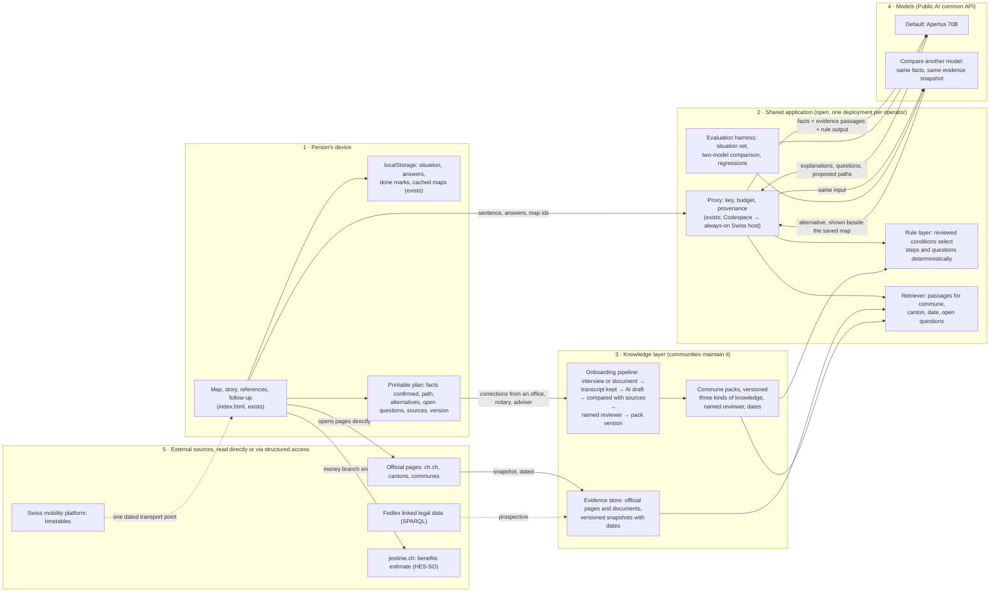

# Target architecture — after the October discussions

This describes where the system goes if the pilot proceeds. It keeps the prototype's shape (one page, a persistent map, a proxy, a controlled catalogue) and adds three things the discussions converged on: a knowledge layer that communes maintain, evidence retrieved for a situation instead of a prompt-stuffed catalogue, and a printable plan that leaves the app. What exists today is marked; everything else is planned.

## What changes from the prototype

| Today | Target | Why |
| --- | --- | --- |
| A fixed `CATALOG` of 14 entries inside `index.html`, sent whole to the model | Commune packs, one versioned file per commune, plus an evidence store of dated page snapshots; a retriever selects the passages relevant to this situation | The catalogue cannot grow past a few dozen entries inside a prompt; packs and retrieval scale per commune and keep source relationships explicit |
| The model proposes consequential steps and picks a page for each | Reviewed conditions in the rule layer select consequential steps and questions; the model interprets the person's words, proposes wording, explains changes | Same facts, same steps for everyone; the explanation stays visibly distinct from the reviewed rule |
| Draft notes with no reviewer or date | Every pack entry carries kind of knowledge, source, jurisdiction, applicable date, named reviewer, review date; conflicts are kept as conflicts | The badge then describes a checked claim, not a link |
| One model, one provider, a hackathon key | Public AI's common API; a default model and "Compare another model" on identical input; provider, model and processing location shown on every answer | Model choice becomes a learning feature and an evaluation signal, not a certification |
| Codespace started by hand | Always-on proxy on a Swiss host; budget and provenance unchanged | A stranger can arrive at any hour |
| Copy-the-plan button | A printable plan with the facts confirmed, the path, alternatives considered, open questions and assumptions, documents, offices, exact sources with dates, review status, plan version, and space for a professional's notes | The plan works in an office or a notary's room; corrections flow back as proposed pack changes |
| jestime.ch as one catalogue entry | The money branch ends at jestime.ch for the estimate; their result page could point back to a map | Complementary, not duplicated; the calculation stays with the reviewed tool |

## Three kinds of knowledge, kept apart

- Laws and published regulations: requirements and conditions. Shown with the exact source, jurisdiction and applicable date. Prospective structured access: Fedlex.
- Administrative practice: how an office handles a procedure. Shown with the named office, a reviewed explanation and its review date.
- Community experience: everyday life, customs, useful local advice. Shown as attributed perspectives, several voices, clearly identified as community knowledge, never as a rule.

A map step may draw on all three, but the panel says which is which. If an interview contradicts a published page, the pack records the conflict and the reviewer decides; the application never merges them into one confident paragraph.

## Onboarding a commune

1. A member of staff explains the commune in their own language, by document or by a recorded interview, with consent. Questions: what residents misunderstand, which office handles what, what the website lacks, what changes for an owner, a tenant, a family, a pensioner.
2. The transcript is kept. A model drafts pack entries from it.
3. The draft is compared with the published sources; gaps and outdated pages are listed.
4. A named reviewer approves manageable pieces, one entry at a time. No prompts, no software to maintain on the commune's side.
5. The pack version is published; the shared application picks it up. "Plug and play" means exactly this and nothing more.

## Languages

Interface and explanations in the person's language; the pack keeps the original terms and sources (a French speaker exploring a Ticino commune sees the Italian terms the office will use). Community contributions are kept in their original language with a translation marked as such.

## Operations and evaluation

- Proxy on a Swiss host with the same budget and provenance rules as today; processing location shown only when configured and verified.
- Evaluation set of situations (started in `EVALUATION.md`) run against the live models; two-model comparison on identical input as the standard regression; an unsupported claim in either model's output is a test failure, agreement between models is evidence, not certification.
- Everything personal stays in the person's device; the service stores packs, evidence snapshots, counters and evaluation results, never situations.

## First pilot, unchanged in scope

One journey, Nyon and Saint-Cergue, Gland as comparison. Test in order: interview-based onboarding with one commune contact, a small reviewed pack, source-grounded paths through the retriever, the printable plan in one real office conversation, and the two-model comparison on that same material as an evaluation exercise. Six weeks, a public report, a decision to expand, revise or stop.
